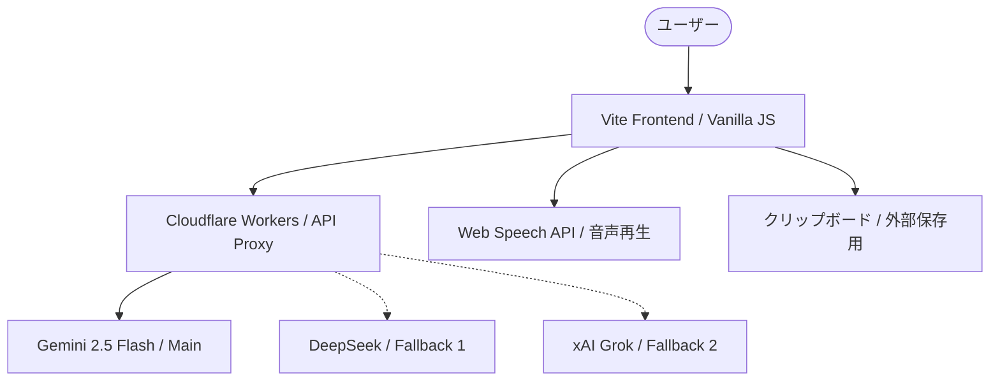

# 推奨構成一覧

## 1. 技術スタック

| 項目 | 推奨 | 推奨度 | 理由 |
|------|------|:------:|------|
| フロントエンド | Vite + Vanilla JS | ☆☆☆☆☆ | 軽量・高速。個人MVPとして最短で実装可能 |
| スタイリング | Vanilla CSS | ☆☆☆☆ | 柔軟性が高く、フレームワークの学習コスト・制約がない |
| ホスティング | Cloudflare Pages | ☆☆☆☆☆ | 高速かつ無料枠が強力。Workersとの親和性が高い |

## 2. バックエンド構成

| 項目 | 推奨 | 推奨度 | 理由 |
|------|------|:------:|------|
| APIプロキシ | Cloudflare Workers | ☆☆☆☆☆ | APIキーを安全に隠蔽。フロントから直接叩くリスクを回避 |
| 構成 | Pages + Workers 統合 | ☆☆☆☆☆ | 同一リポジトリ・同一プロジェクトとして一元管理可能 |

## 3. LLM API設定

| 項目 | 推奨 | 推奨度 | 理由 |
|------|------|:------:|------|
| メインモデル | Gemini 2.5 Flash | ☆☆☆☆☆ | `spec.md` 指定。コスト・速度・性能のバランスが最適 |
| フォールバック1 | DeepSeek-V3 | ☆☆☆☆ | 非常に安価で回答品質も高いため、サブに最適 |
| フォールバック2 | xAI Grok-beta / Claude Haiku | ☆☆☆ | Grokの可用性次第だが、安定性ならHaikuも選択肢 |
| 補助モデル | Phase 1では省略 | ☆☆☆☆ | 実装をシンプルに保つため、失敗時は即フォールバックで対応 |

## 4. データ連携

| 項目 | 推奨 | 推奨度 | 理由 |
|------|------|:------:|------|
| 保存先 | Google Sheets | ☆☆☆☆ | 構造がシンプルでAPI連携しやすい。手動ペースト先としても優秀 |
| 連携方法 | クリップボードコピー優先 | ☆☆☆☆☆ | Phase 1は「コピーして他サービスへ貼る」を基本とし工数削減 |
| 出力形式 | JSON / 定型テキスト | ☆☆☆☆☆ | NotionやSheetsへ貼り付けやすいフォーマットをUIで提供 |

## 5. UI・UX設計

| 項目 | 推奨 | 推奨度 | 理由 |
|------|------|:------:|------|
| デザイン方針 | モダン・プレミアム | ☆☆☆☆☆ | 学習のモチベーションに寄与。ダークモード対応必須 |
| モバイル対応 | レスポンシブ必須 | ☆☆☆☆ | 移動中や隙間時間の「音読」を考慮し、スマホ表示を重視 |
| 言語 | 日本語 | ☆☆☆☆☆ | メインターゲットに合わせて直感的な操作を優先 |

## 6. 開発・運用

| 項目 | 推奨 | 推奨度 | 理由 |
|------|------|:------:|------|
| テスト | 手動 + 最小限の単体テスト | ☆☆☆☆ | ロジックの複雑な部分のみテスト。UIは手動で十分 |
| CI/CD | GitHub Actions | ☆☆☆☆ | Cloudflare Pagesへの自動デプロイを構築し、開発を効率化 |
| ログ・監視 | console.log 中心 | ☆☆☆☆ | 個人用MVPのため、過度な監視ツールは導入しない |

## 7. 優先順位・マイルストーン

| 項目 | 推奨 | 推奨度 | 理由 |
|------|------|:------:|------|
| 開発順序 | 生成ロジック優先 | ☆☆☆☆☆ | プロンプトエンジニアリングとLLM連携の安定を最優先 |
| 目標 | 1日1ナラティブの実践 | ☆☆☆☆☆ | 開発者自身が使い、価値を検証できる状態を早急に作る |

---

## 構成サマリー図

